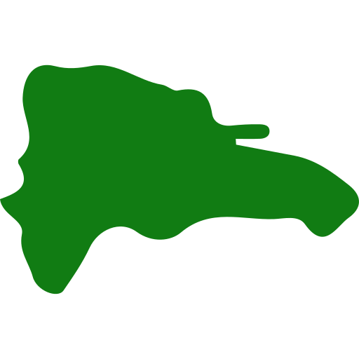

  

# Provincias de República Dominicana
Un proyecto que contiene todas las provincias de la República Dominicana con sus municipios en diferentes formatos de presentación de data.

 

## Formatos Disponibles
- JSON.
- XML.
- CSV.
- TypeScript.
- JavaScript.

 

## Contributions

| Name                 |  Contribution           |  Email                        |
|----------------------|-------------------------|-------------------------------|
| Jack Pacheco         |  Developer & Designer   |  jackdamiolixp@gmail.com      |

 
 

*Cualquier sugerencia favor escribir y sin problema será atenida:*
- [Email](mailto:jackdamiolixp@gmail.com).

 

*Icono del README creado por [Freepik](https://www.freepik.com) de [Flaticon](https://www.flaticon.com/).*